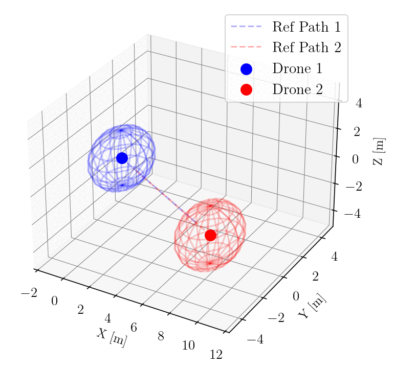

# Collision Avoidance for Drones in 3D using Model Predictive Control (MPC)

This repository provides an implementation of a **Model Predictive Control (MPC)** framework for real-time **collision avoidance** in a 3D environment for multiple drones. It ensures safe navigation while achieving trajectory tracking objectives.

- 3D drone dynamics modeling
- Real-time trajectory tracking
- Predictive collision avoidance for multiple UAVs
- Configurable constraints (velocity, acceleration, safety distance)
- Modular and simulation-ready design

## 📽️ Demo

This is a demonstration of a clean control
<p align="center">
  
</p>

To extend this setup to a more realistic scenario, we simulate more complex and dynamic collision routes that better reflect real-world drone behavior. Additionally, we integrate neural networks trained to predict the future trajectory of the other drone based on its past movements and environmental cues. This predictive capability enhances the controller’s ability to anticipate and avoid potential collisions in uncertain or non-deterministic environments.

<p align="center">
  
</p>

<p align="center">
  
</p>

<p align="center">
  
</p>

<p align="center">
  
</p>

<p align="center">
  
</p>

<p align="center">
  
</p>


## 🧠 Algorithm Summary

This system uses MPC to:
- Predict future states of each drone over a finite time horizon.
- Optimize control inputs to minimize deviation from a desired trajectory.
- Introduce soft or hard constraints to avoid inter-drone collisions.
- Solve a constrained optimization problem at each time step.


## 📦 Prerequisites

Before you begin, ensure your environment meets the following requirements:

* **Python** ≥ 3.6
* **PyTorch** ≥ 1.0 (CUDA support recommended for faster training)
* **matplotlib, numpy, scipy**

We also recommend using a virtual environment (e.g., `venv` or `conda`) to avoid package conflicts.

## 🚀 Getting Started
```bash
git clone https://github.com/yourusername/collision-avoidance-mpc.git
cd collision-avoidance-mpc
pip install -r requirements.txt
```

## 📌 Citation
If you use this code or build upon our work, please cite our paper:


```bibtex
@article{altinses2025XXX,
  title={Empty},
  author={Altinses, Diyar and Andreas, Schwung},
  journal={Empty},
  volume={XX},
  number={XX},
  pages={XX--XX},
  year={XXXX},
  publisher={IEEE}
}
```


## 📚 References 

Below are selected related works and projects that inspired or complement this research:

<a id="1">[1]</a> Altinses, D., Torres, D. O. S., Lier, S., & Schwung, A. (2025, February). Neural Data Fusion Enhanced PD Control for Precision Drone Landing in Synthetic Environments. In 2025 IEEE International Conference on Mechatronics (ICM) (pp. 1-7). IEEE.

<a id="1">[2]</a> Altinses, D., Salazar Torres, D. O., Schwung, M., Lier, S., & Schwung, A. (2024). Optimizing Drone Logistics: A Scoring Algorithm for Enhanced Decision Making across Diverse Domains in Drone Airlines. Drones, 8(7), 307.

<a id="1">[3]</a> Altinses, D., Torres, D. O. S., Gobachew, A. M., Lier, S., & Schwung, A. (2024). Synthetic Dataset Generation for Optimizing Multimodal Drone Delivery Systems. Drones (2504-446X), 8(12).


